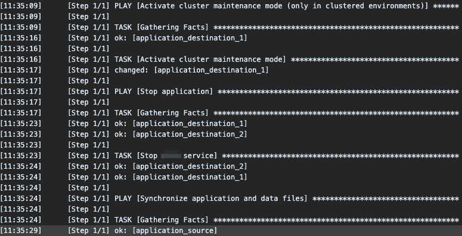

# Ansible Callback Plugin for Teamcity

## Introduction

This [Ansible](https://ansible.com) [callback plugin]() formats the output of an Ansible playbook, so that it can be better interpreted by TeamCity.

## Why?

Because Ansible logs in Teamcity look like this:

With this plugin in place, they look like this:

All plays and tasks are nicely put into their own blocks allowing TeamCity to collapse them and calculate the different times.

## Usage

You have different options of using this plugin:

* In your playbook repository:
  * Create a folder named `callback_plugins` directly where your playbook lives
  * Download the [file teamcity.py](https://raw.githubusercontent.com/dodevops/ansible-teamcity-callback/master/teamcity.py) and place it in inside the `callback_plugins` directory
* Somewhere else:
  * [Download](https://github.com/dodevops/ansible-teamcity-callback/archive/master.zip) or [clone](https://github.com/dodevops/ansible-teamcity-callback.git) the plugin, unzip it and place the folder somewhere accessible (i.e. use the [Teamcity tools feature](https://confluence.jetbrains.com/display/TCD18/Installing+Agent+Tools) to distribute the plugin to all agents)
  * Use the following environment variable to tell Ansible where to find your plugin:\
    `export ANSIBLE_CALLBACK_PLUGINS=<path of your plugin>`

Set the following environment variable to use the plugin:

    export ANSIBLE_STDOUT_CALLBACK=teamcity

Then run your playbook.